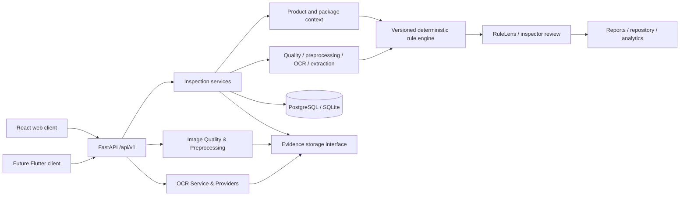

# LabelSure architecture

Team APEX · SIH26034 · Web first · Phase 7

## Scope and implementation status

Implemented in Phase 1: React/Vite application shell, API client, routing, Tailwind styling, FastAPI application factory, environment configuration, SQLAlchemy engine/session foundation, explicit CORS, database readiness endpoint, tests and container definitions.

Implemented in Phase 2: Alembic migration infrastructure (`0001_users`), User ORM entity, Argon2 password hashing, JWT authentication, RBAC dependencies (`ADMIN`, `INSPECTOR`, `SUPERVISOR`), and protected web routes.

Implemented in Phase 3: Inspection creation, product/package context ingestion, multi-image evidence upload with panel type classification, binary magic bytes validation (JPEG, PNG, WebP), SHA-256 calculation, local storage abstraction (`storage/inspections/<id>/originals/`), inspection lifecycle management (`DRAFT` → `EVIDENCE_UPLOADED` → `READY_FOR_ANALYSIS`), post-submission locking (HTTP 409), inspection repository list/filter/pagination, inspection details view, dashboard real metrics summary, and authenticated client-side evidence streaming (`AuthorizedImage`).

Implemented in Phase 4: Isolated image processing and computer vision quality assessment layer (`backend/app/image_processing/`):
- Explainable, deterministic CV quality signals: Blur / Focus (Laplacian Variance), Brightness (Mean luminance), Contrast (Standard deviation), Glare / Specular Overexposure (Near-white pixel ratio), and Resolution dimension checks.
- Categorization into controlled statuses (`GOOD`, `ACCEPTABLE`, `POOR`, `UNREADABLE`, `PROCESSING_FAILED`) and flags (`BLURRY`, `TOO_DARK`, `TOO_BRIGHT`, `LOW_CONTRAST`, `LOW_RESOLUTION`, `POSSIBLE_GLARE`, `INVALID_IMAGE`, `PROCESSING_ERROR`).
- Packaging-specific OpenCV preprocessing: Safe EXIF orientation normalization, LAB color-space CLAHE local contrast enhancement, edge-preserving bilateral denoising, and lossless PNG generation.
- Strict evidence immutability: Original evidence remains untouched; preprocessed OCR-ready artifacts are stored separately under `storage/inspections/<id>/processed/<image-id>/ocr_ready.png`.
- Alembic migration `0003_image_quality` and ORM model `ImageProcessingResult`.
- Endpoints for single/batch processing and authenticated preprocessed artifact streaming with IDOR defense and RBAC.
- Frontend image quality cards, status badges, metrics visualization, and side-by-side comparison modal.

Implemented in Phase 5: OCR Engine and Evidence Text Extraction layer (`backend/app/ocr/`):
- **Core Philosophy**: *AI OBSERVES. RULES DECIDE. EVIDENCE EXPLAINS. INSPECTORS VERIFY.* OCR is strictly an evidence observation stage and produces NO regulatory verdicts (`PASS`/`FAIL`).
- **Provider Abstraction (`BaseOCRProvider`)**: Pluggable engine interface with production adapter `PaddleOCRProvider` (PP-OCRv6, CPU-optimized on Windows) and deterministic `MockOCRProvider` for sub-second test automation.
- **Traceable OCR ORM Entities**: `OCRRun` (engine metadata, language, status, execution timestamps, average confidence, block counts, error codes) and `OCRBlock` (raw text, normalized text, confidence score, confidence tier `GOOD`/`REVIEW`/`LOW`, 4-point polygon coordinates, axis-aligned bounding box, line number, reading order).
- **Alembic Migration `0004_ocr`**: Tables `ocr_runs` and `ocr_blocks` with cascading foreign keys and indexes.
- **Statutory-Safe Normalization & Reading Order**: Unicode NFKC normalization, whitespace collapsing without altering numbers/symbols, and spatial line clustering with natural top-to-bottom, left-to-right reading order sorting.
- **Evidence Immutability**: OCR reads from Phase 4 derived preprocessed artifacts (`ocr_ready.png`) while keeping original evidence immutable.
- **Single & Batch OCR Endpoints**: Endpoints for per-image OCR, batch inspection OCR, OCR block retrieval, and aggregate multi-panel summary.
- **Interactive Frontend UI**: Responsive SVG bounding box overlay with confidence tier styling, hover/click cross-highlighting with text block table, and multi-panel OCR text summary tabs.

Rule evaluation (RuleLens / Phase 8), compliance PASS/FAIL verdicts, PDF generation, and mobile Flutter clients remains for subsequent phases.

## Boundaries



Use one modular backend, not microservices. Routes validate HTTP inputs; services manage workflows and transactions; repositories access persistence; adapters wrap OCR and file storage. Pydantic contracts separate these components. The frontend never imports regulatory logic or accesses the database. `/api/v1` and OpenAPI form the future mobile integration boundary.

## Package layout

```text
backend/app/
  api/             HTTP routers (health, auth, dev_access, inspections, dashboard)
  core/            Settings, security (JWT, Argon2 hashing), CV & OCR thresholds
  db/              Engine, Base, session factory
  image_processing/ ImageQualityAnalyzer, ImagePreprocessor, ImageProcessingPipeline, Schemas
  models/          Domain ORM entities (User, Inspection, InspectionImage, ImageProcessingResult, OCRRun, OCRBlock, Enums)
  ocr/             BaseOCRProvider, PaddleOCRProvider, MockOCRProvider, OCRService, Normalization, Schemas
  schemas/         Pydantic v2 input/output contracts (Auth, Inspection, Dashboard, Quality, OCR)
  services/        Inspection access/ownership and code generation services
  storage/         LocalStorageService, magic bytes detection, SHA-256 calculation
  rules/           Loader, applicability and deterministic validators (Phase 8)
frontend/src/
  api/             Axios transport with Bearer token interceptor
  auth/            AuthContext and ProtectedRoute
  components/      AppLayout, AuthorizedImage, OCRBoundingBoxCanvas, OCRBlockTable, InspectionOCRSummarySection
  pages/           Login, App (Dashboard), NewInspection, InspectionsList, InspectionDetail, ComingSoon
docs/              Design and delivery contracts
```

## Processing and evidence

Each analysis creates a new run with ordered, timestamped stage events: UPLOAD, IMAGE_QUALITY, PREPROCESSING, OCR, DECLARATION_EXTRACTION, CONTEXT, RULE_EVALUATION, COMPLETED.

Original uploaded images are immutable. They are stored under `storage/inspections/<inspection_id>/originals/` using cryptographically generated unique filenames (UUID-based). Derived preprocessed images are stored under `storage/inspections/<inspection_id>/processed/<image-id>/ocr_ready.png`. User-provided filenames are preserved only as metadata in the database alongside SHA-256 digests, MIME types, file sizes, and panel designations (`FRONT`, `BACK`, `LEFT`, `RIGHT`, `TOP`, `BOTTOM`, `DECLARATION_PANEL`, `MRP_PANEL`, `OTHER`).

Storage abstraction interface:
- `LocalStorageService`: Resolves and enforces path traversal boundaries, saves binary bytes to isolated original and processed evidence folders, reads binary streams, and deletes evidence files when draft images are removed.
- Magic byte sniffing validates file headers (`\xff\xd8\xff` for JPEG, `\x89PNG\r\n\x1a\n` for PNG, and `RIFF....WEBP` for WebP) to prevent MIME-spoofing attacks.
- Configurable upload limits: `MAX_UPLOAD_SIZE_MB` (default 15 MB) and `MAX_IMAGES_PER_INSPECTION` (default 20 images).

## Data and operations

PostgreSQL is the deployment database; SQLite supports single-process local development. SQLite foreign keys are enabled. Sessions are request-scoped; services explicitly commit atomic operations. FastAPI lifespan owns engine disposal.

Configuration uses `LABELSURE_` environment variables; `.env` files remain untracked. JWT authentication enforces RBAC across:
- `INSPECTOR`: Creates inspections, edits own drafts, uploads/deletes draft evidence, submits own inspections, processes quality on own evidence, views own records.
- `ADMIN`: Full administrative access across all inspection records, evidence, and image processing.
- `SUPERVISOR`: Read-only access to all inspections, image metadata, quality metrics, and streamed image content. Modifying, submitting, or triggering processing is rejected with HTTP 403.
- Non-owners receive HTTP 404 to avoid IDOR existence leakage.

## Risks and decisions

* OCR on glare, curved surfaces or incomplete panel coverage can miss real declarations. Insufficient evidence yields UNCERTAIN.
* Rule applicability needs explicit context; unknown context is not NOT_APPLICABLE.
* Physical font height requires a reliable scale and perspective correction. Without calibration return UNVERIFIED.
* PaddleOCR/PaddlePaddle model downloads and hardware latency require a separate environment trial in Phase 5.
* Original evidence images are strictly preserved untouched; all computer vision pre-processing generates derived artifacts separately with traceable SHA-256 hashes.

## Phase 6 — structured declaration extraction

Implemented in `app/extraction/`: API routes delegate to a service; `engine.py` combines bounded patterns and spatial context, `normalizers.py` provides typed values, `spatial.py` restricts neighboring blocks, and `scoring.py` supplies explainable confidence contributions. No LLM adapter, API key, worker, or legal rule engine is required.

Pipeline: latest OCR run per image → usable SUCCESS/PARTIAL evidence → Unicode NFKC and control-character cleanup of a working copy → keyword/pattern matching → same-image neighboring blocks → normalized candidates → scoring → duplicate/conflict review → transactional persistence. OCR raw text and inspection status are never changed.

Supported types: COMMON_PRODUCT_NAME; MANUFACTURER_NAME/ADDRESS; PACKER_NAME/ADDRESS; IMPORTER_NAME/ADDRESS; NET_QUANTITY; MRP; MONTH_YEAR; COUNTRY_OF_ORIGIN; CONSUMER_CARE_NAME/ADDRESS/PHONE/EMAIL; BARCODE_OR_GTIN; UNIT_SALE_PRICE; OTHER. OTHER requires an explicit "Other declaration:" label, rather than classifying arbitrary text.

Money uses Decimal and INR amounts with two decimals; comma separators are removed (including the requested "1,20/-" OCR example). Quantity aliases normalize to g, kg, ml, L, or count without changing magnitude. Dates normalize only unambiguous four-digit-year month/year forms; two-digit years retain an unresolved century and require review. Country text is observed without determining import status. GTIN requires a contextual label, supported length, and a valid check digit. Product names need an explicit label or an exact front-panel OCR match to inspector metadata, and remain review candidates.

Spatial context considers at most four following blocks. Blocks must be on the same row within four text heights, or vertically aligned within two text heights. A detected declaration label terminates a group. Organization/address parsing remains heuristic.

Confidence is the sum of documented contributions, clamped to 0–1:
- 0.55 × minimum supporting OCR confidence.
- Keyword: 0.20 for deterministic patterns; 0.10 for heuristics.
- Format: 0.15 for valid deterministic parses; 0.05 for heuristic/ambiguous parses.
- Spatial: 0.05 for same-block or accepted neighboring context.
- Panel: 0.05 for BACK, DECLARATION_PANEL, or MRP_PANEL.

Scores below 0.80, ambiguous dates, and heuristic interpretations require review. These weights are engineering heuristics, not statistically calibrated probabilities. Each contribution is stored and visible.

Every candidate references an extraction run, OCR run, source image, first supporting OCR block, and an ordered many-block source relationship. Raw value is the exact newline-joined supporting OCR text. Source responses include original text, polygons, and bounding boxes. The structured value includes internal `_source_image_variant` metadata for the existing original/processed viewer.

Duplicate values on different blocks/images remain separate. One highest-scoring candidate is primary when no strong disagreement exists. Distinct normalized values with scores ≥0.80 mark every candidate of that type for review and leave all non-primary. Some legitimate multiple contacts/dates can therefore be flagged conservatively.

An extraction run is unique by inspection, version, and SHA-256 fingerprint of latest OCR run IDs/statuses, image IDs/panels, and product-name context. New OCR, panel changes, context changes, or version changes require a new extraction; current list/summary never presents an old snapshot as current. Historical candidate detail remains readable by ID. Failed latest OCR does not fall back silently to an older success. Empty usable OCR is a 409 precondition; missing/partial panels yield PARTIAL with warnings. Persistence is atomic; unexpected failures roll back rather than leaving partial candidates. Run status enums reserve PENDING/PROCESSING/FAILED for future observability; completed calls persist SUCCESS/PARTIAL.

Limits: 5,000 usable OCR blocks, 2,048 characters per block, and 1,000 candidates; oversized input is rejected with 422. Patterns have bounded captures and spatial windows. React renders text through escaped text nodes; no HTML injection or external network interpretation is used.

Limitations: machine-generated candidates do not establish legal compliance. OCR errors can propagate. Low confidence requires review; missing extraction does not establish absence. Company/address and country parsing are heuristic, product names can remain undetected, and no multilingual semantic parser or barcode vision is provided. Historical Phase 5 derived artifacts are not independently versioned: the viewer uses the existing processed/original endpoint based on the OCR processing link, so subsequent reprocessing can change a displayed derived image. Original evidence and OCR block provenance remain intact. This phase adds no manual verification mutations, applicability determination, legal verdicts, or compliance reports.


## Phase 7 — context and applicability preparation

The `app/context/` layer sits between extraction and future legal evaluation. Routes delegate to ContextService; `facts.py` defines normalization and stable keys, `resolver.py` builds source facts and resolves context, `scoring.py` preserves source confidence and priority, and `applicability.py` supplies explicitly unverified, non-executable preparation hints. No law corpus, LLM, queue, GPU, or vector database is added.

Inputs are inspection category/package/import metadata, optional inspector context input, the current Phase 6 extraction snapshot, latest per-image OCR status/confidence, image panel/quality/hash information, and pipeline versions. Stale extraction is never silently reused. Without extraction, declaration detection is UNKNOWN/null; after an extraction, false means only "no candidate detected."

Persisted source facts retain normalized and raw values, source type/reference, confidence, explanation, and source references. Resolved values are separate and retain supporting fact IDs. Resolution states are KNOWN, INFERRED, UNKNOWN, CONFLICTING, REVIEW_REQUIRED. A disputed preferred value always travels with its state; the stable rule-input keys do not flatten it into an unquestioned scalar.

Source order: MANUAL_OVERRIDE (reserved) > INSPECTOR_INPUT > INSPECTION_METADATA > DECLARATION_CANDIDATE > OCR_EVIDENCE > SYSTEM_INFERENCE. Inspector values have null confidence. Candidate-based context retains native extraction confidence; no composite probability is invented. Candidate review flags or confidence below 0.80 require review. Different normalized source values remain visible. Disagreement with a known or confidence >=0.60 source is CONFLICTING; weaker disagreement is REVIEW_REQUIRED. Priority determines the displayed preferred value only.

Package values normalize to PACKET, BOX, BOTTLE, JAR, CAN, POUCH, TUBE, CARTON, OTHER, UNKNOWN. Category values use FOOD, COSMETIC, HOUSEHOLD, PERSONAL_CARE, ELECTRONICS, OTHER, UNKNOWN; unknown taxonomy labels map to OTHER while raw input is retained. This is not an exhaustive regulatory taxonomy.

Quantity aliases resolve g/kg to WEIGHT, ml/L to VOLUME, count/pcs/pieces to COUNT, m/cm/mm to LENGTH, and m2/m² to AREA. Unsupported or absent units remain UNKNOWN. Phase 6 currently extracts a smaller unit set; Phase 7 can accept explicit inspector quantity kind without pretending it was extracted.

A country observation does not infer import status. Importer candidates supply a possible IMPORTED signal with REVIEW_REQUIRED, never automatic confirmation. DOMESTIC metadata versus importer evidence is retained as a disagreement. Explicit inspector inputs are saved separately and can be removed with null; omitted input fields retain saved values.

Evidence sufficiency uses ordered technical gates:
1. No images/usable OCR, unreadable or processing-failed images, or missing/failed critical-panel OCR → INSUFFICIENT.
2. Source/candidate conflicts, review candidates, low/review OCR confidence, or POOR quality → REVIEW_REQUIRED.
3. Missing/current-partial extraction, incomplete OCR coverage, unknown OCR confidence, or missing quality assessment → PARTIAL.
4. Otherwise → SUFFICIENT_FOR_RULE_EVALUATION.

Critical panels are DECLARATION_PANEL and MRP_PANEL. OCR confidence state uses the minimum available latest-run average confidence: GOOD >=0.85, REVIEW >=0.60, LOW below; unavailable confidence is UNKNOWN. These are engineering readiness gates. They never establish complete physical package coverage or legal absence.

Each resolution creates an InspectionContext, ContextResolutionRun, ContextFacts, and RuleInputSnapshot atomically. A SHA-256 fingerprint covers inputs, candidate state/provenance, quality status/hash, explicit context and versions. Unique inspection/version/fingerprint prevents duplicate facts for identical inputs. Facts are active within their originating run; current APIs select the run matching current inputs. Historical facts are retained. `selected_at` records which saved inspector inputs to reuse when explicitly revisiting a cached run; it does not alter the snapshot.

The snapshot embeds source inputs, candidate values and OCR sources, resolved context, source facts, evidence assessment, stable keys, conflicts, and applicability preparation. It stores a canonical JSON SHA-256 digest. No snapshot mutation endpoint exists; ORM replacement raises an error, and reads verify the digest. Historical access is by authorized snapshot ID. Phase 8 should bind evaluations to snapshot ID/hash and its independently verified rule version.

Limits: inspector strings 100 characters; extra input keys forbidden; malformed/control Unicode rejected in explicit input. Source text uses bounded normalization. Candidate inputs are limited to 1,000 and 2 MB serialized; complete snapshots to 5 MB serialized. Rendering uses React text nodes. Internal storage paths, credentials, and user records are excluded from the snapshot projection.

Context inference is not a legal verdict. OCR errors can propagate. Candidate absence does not prove declaration absence. Applicability preview is not compliance evaluation. Unknown/conflicting context remains explicit. Sector-specific regulations, physical font-size compliance, and legal rule execution are not implemented.

